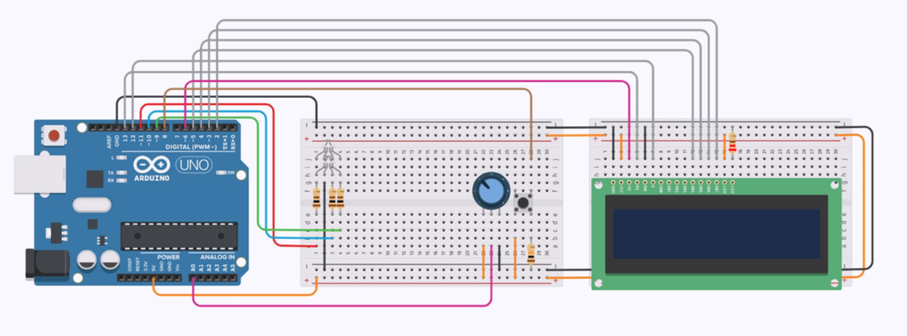

# Arduino Color Guessing Game

A simple Arduino project that implements a color recognition game using an RGB LED, potentiometer, button, and LCD display. The system randomly generates a color, and the user attempts to match it.

## Features

* Random color generation (RGB LED)
* Color selection using potentiometer
* Confirmation via button input
* Real-time feedback on LCD display
* Basic game loop with automatic reset

## Hardware

* Arduino
* RGB LED
* Potentiometer
* Push button
* LCD display (16x2)

## How It Works

1. A random color is displayed using the RGB LED
2. The user selects a color via potentiometer
3. The selected color name is shown on the LCD
4. Button press confirms the choice
5. System displays correct/incorrect result
6. After a short delay, a new round starts

## Circuit

## Notes

* Includes predefined color ranges mapped to potentiometer values
* Can be extended for basic color vision testing
* Designed as a simple embedded systems project
